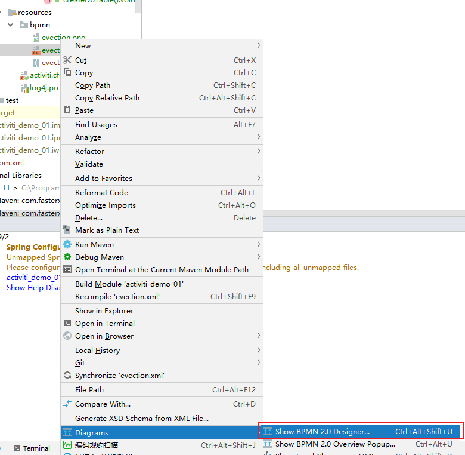
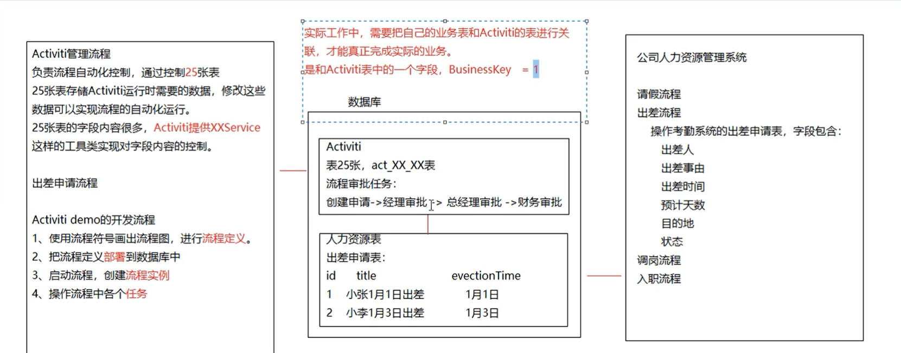

Activiti 7

ACT_RE_DEPLOYMENT 流程部署表，每部署一次增加一条记录
ACT_RE_PROCDEF 流程定义表
ACT_GE_BYTEARRAY 流程资源表

update ACT_GE_PROPERTY


ACT_RE_DEPLOYMENT 流程部署表，每部署一次增加一条记录
ACT_RE_PROCDEF 流程定义表
ACT_GE_BYTEARRAY 流程资源表

update ACT_GE_PROPERTY


CREATE DATABASE activiti DEFAULT CHARACTER SET utf8;

select distinct RES.* 
from ACT_RU_TASK RES inner join ACT_RE_PROCDEF D on RES.PROC_DEF_ID_ = D.ID_ 
WHERE RES.ASSIGNEE_ = 'zhangsan' and D.KEY_ = 'myEvection' order by RES.ID_ asc LIMIT 2147483647 OFFSET 0

zhangsan(String), myEvection(String), 2147483647(Integer), 0(Integer)

## 总结

### 1 Activiti的表的说明

使用25张表

ACT_RE  			流程定义 流程资源

ACT_RU			运行时的表 流程实例 任务 变量

ACT_HI 			历史表

ACT_GE			通用数据表

### 2 Activiti的架构、类关系图

获取流程引擎的工具类

- ProcessEngines.使用默认方式获取配置文件，构造流程引擎。配置文件的名字 activiti.cfg.xml，要放在classpath下
- ProcessEngineConfiguration.createProcessEngineConfigurationFromResource("activiti.cfg.xml"); 可以自定义配置文件名

使用上面2个工具类，都可以获取流程引擎 ProcessEngine：流程引擎。获取各种服务的接口。

服务接口：用于流程的部署，执行、管理，使用这些接口就是在操作对应的数据表。

RespositoryService      资源管理类

RunTimeService			运行时管理类

TaskService					任务管理类

HistoryService				历史数据管理类

ManagementService	流程引擎管理类	

### 3 BPMN插件

idea 下 安装 actiBPM 插件 ，

### 4 流程符号 画流程图

流程符号：事件 Event、活动Activity 、网关 Gateway 、流向 Flow 

bpmn本质上是xml文件，因为安装了actiBPM插件，才能可视化看到流程内容

创建bpmn文件，在流程设计器内使用流程符号来表达流程。指定流程的key，指定任务的负责人

生成png文件：把bpmn文件后缀改为xml，这个文件上右键选择Diagrams->show BPMN2.0 desinger，打开窗口，点击导出文件按钮，选择导出文件类型为png，注意乱码。



### 5 部署流程

使用Activiti提供的API把流程图的内容写入数据库中。

属于资源类的操作，使用RespositoryService，

单文件部署：把bpmn和png一个一个处理

压缩包部署：把bpmn和png打压缩包处理

```java
Deployment deploy = repositoryService.createDeployment()
```

部署操作表：

act_re_deployment 部署表

act_re_procdef 流程定义表

act_ge_bytearray 通用资源表

### 6 启动流程的方式

使用RunTimeService，根据流程定义的key

核心代码：

```
ProcessInstance instance = runtimeService.startProcessInstanceByKey("myEvection");
```

操作表：

```
act_hi_actinst 流程实例执行历史
* act_hi_identitylink 流程的参与用户历史信息
* act_hi_procinst 流程实例历史信息
* act_hi_taskinst 流程任务历史信息
* act_ru_execution 流程执行信息
* act_ru_identitylink 流程的参与用户信息
* act_ru_task 任务信息
```

### 7 任务查询

使用TaskService，根据流程定义的Key，任务的负责人来进行查询

核心代码：

```java
// 3.根据流程的key 和任务的负责人 查询任务
List<Task> taskList = taskService.createTaskQuery()
        .processDefinitionKey("myEvection") // 流程key
        .taskAssignee("zhangsan") // 要查询的负责人
        .list();
```

### 8 任务完成

使用TaskService，用任务Id完成任务

```
taskService.complete(task.getId());
```


### 9 删除流程定义

act_ge_bytearray

act_re_deployment

act_re_procdef


## 2 进阶

